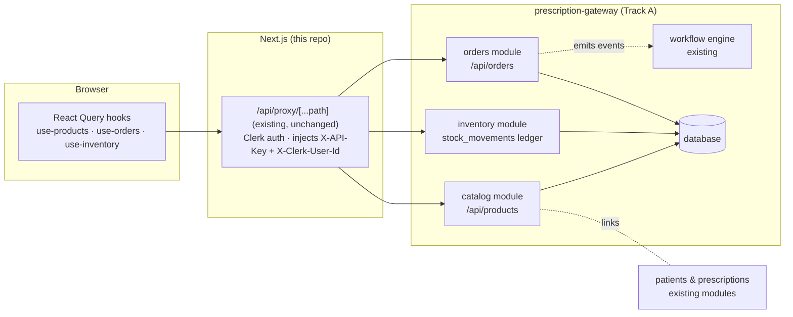

# Products, Orders & Inventory — Implementation Plan

**Repo:** `cloud-care-pharmacy/clinic-portal` · **Date:** 14 Jul 2026 · **Status:** Proposed
**Architecture:** backed by **our own backend** (the prescription-gateway), exactly like patients, tasks and consultations — *not* by a direct Shopify connection.

---

## 1. Executive summary

Build Products, Orders and Inventory as **first-class gateway modules** with the portal consuming them through the existing `/api/proxy` → gateway path, React Query hooks, and the established `{ success, data }` response envelope. This is the pattern every other feature in the portal already follows, and it is what the products mock was explicitly designed for — `mock-products.ts:1`: *"Swap this file for TanStack Query hooks (`use-products`) backed by the gateway once `/v1/products` ships."*

The work splits into **two parallel tracks** after a one-day contract sign-off:

| Track | Where | Scope | Effort |
|---|---|---|---|
| **A — Backend** | `prescription-gateway` repo | 3 new modules: catalog, inventory ledger, orders — schema, endpoints, business rules, audit | ~6–8 days |
| **B — Frontend** | this repo | types + hooks + swap Products off the mock, build Orders UI + Rx verification, build Inventory page. **Zero new server code** — the existing catch-all proxy already forwards any `/api/proxy/<path>` to the gateway | ~4–6 days |

Total ≈ 2–3 weeks solo; ~1.5–2 weeks with the tracks parallelised. Everything in Track B can start immediately against the contract in §5.

Key design wins over the alternatives considered:

- **Orders are clinical objects, not just commerce objects** — they carry `patientId` and per-line `prescriptionId`, joining directly to the existing patients/prescriptions APIs. Rx-gated fulfilment becomes a native foreign key, not a bolted-on tag.
- **Inventory is an append-only movements ledger** with actor identity from `X-Clerk-User-Id` — which yields a *real, audited* S8 controlled-drug register (a hard pharmacy requirement no third-party commerce platform provides).
- The pharmacy domain model (S2–S8 schedules, ARTG, PBS, GST, storage classes) already exists in the frontend and maps 1:1 onto the schema below.

**Shopify:** explicitly out of scope for these modules. The existing per-entity Shopify integration and the workflow engine's Shopify steps remain untouched; if the catalog should ever mirror to a storefront, the integration's dormant sync fields (`syncMode: hourly`) are the future hook. Nothing in this plan depends on it.

---

## 2. Current state (evidence)

| Area | State | Where |
|---|---|---|
| Products UI | Complete & polished — list w/ stat tiles + filters, 5-tab detail, 4-tab add/edit, status lifecycle incl. recall | `src/app/(dashboard)/products/*`, `src/components/products/*` |
| Products data | In-memory per-tab mock; resets on reload | `src/components/products/mock-products.ts` |
| Orders UI | "Coming soon" empty state (19 lines) | `src/app/(dashboard)/orders/OrdersClient.tsx` |
| Inventory | Fields inside the product mock; no ledger, no page | — |
| Gateway API | No product/order/inventory endpoints today (verified against the live API catalog and `src/lib/api.ts`) | `src/lib/api.ts` |
| Conventions to reuse | `{success, data}` envelope, `limit/offset` pagination w/ `total`/`truncated`, `X-API-Key` + `X-Clerk-User-Id` headers, `/api/<resource>` paths, audit log (`listAuditLog`) | `src/types/index.ts:796–871`, `src/app/api/proxy/[...path]/route.ts` |
| Domain types | AU-pharmacy model fully defined and UI-proven | `mock-products.ts:16–95` |

---

## 3. Architecture



- The portal needs **no new route handlers**: `/api/proxy/products?...` already forwards to gateway `/api/products?...` (`route.ts:36`), with auth and secret injection handled.
- All business rules (schedule gating, stock guards, status transitions) are enforced **in the gateway** — the UI only mirrors them as affordances.
- Mutations are attributed via `X-Clerk-User-Id` (already forwarded by the proxy) and written to the existing audit log.

---

## 4. Track A · Backend — data model

Dialect-neutral DDL sketch; adapt to the gateway's migration tooling. IDs follow the existing human-prefixed pattern (`prd_`, `mov_`, `ord_`).

### 4.1 `products`

```sql
CREATE TABLE products (
  id                    TEXT PRIMARY KEY,            -- prd_<uuid>
  entity_id             TEXT NOT NULL,
  -- identification
  name                  TEXT NOT NULL,
  brand                 TEXT,
  generic_name          TEXT,
  sku                   TEXT NOT NULL,               -- uppercase; unique per entity
  barcode               TEXT,                        -- GTIN
  -- pharmaceutical
  category              TEXT NOT NULL,               -- prescription|otc|supplement|device|consumable|compounded|accessory
  form                  TEXT NOT NULL,               -- tablet|capsule|liquid|cream|ointment|injection|inhaler|drops|patch|spray|device|other
  strength              TEXT,
  pack_size             TEXT,
  active_ingredient     TEXT,
  -- regulatory (AU)
  schedule              TEXT NOT NULL DEFAULT 'unscheduled',  -- unscheduled|S2|S3|S4|S8
  requires_prescription INTEGER NOT NULL DEFAULT 0,
  artg_number           TEXT,
  pbs_code              TEXT,
  -- inventory (denormalized current level; ledger is source of history)
  stock_on_hand         INTEGER NOT NULL DEFAULT 0,
  reorder_level         INTEGER NOT NULL DEFAULT 0,
  supplier              TEXT,
  storage               TEXT NOT NULL DEFAULT 'room', -- room|refrigerated|frozen|controlled
  earliest_expiry       TEXT,                         -- ISO date
  -- pricing (AUD)
  cost_price            REAL,
  price                 REAL NOT NULL,
  gst_applicable        INTEGER NOT NULL DEFAULT 0,
  -- lifecycle
  status                TEXT NOT NULL DEFAULT 'active', -- active|inactive|discontinued|recalled
  description           TEXT,
  created_by            TEXT, updated_by TEXT,
  created_at            TEXT NOT NULL, updated_at TEXT NOT NULL
);
CREATE UNIQUE INDEX idx_products_entity_sku ON products(entity_id, sku);
CREATE INDEX idx_products_entity_status   ON products(entity_id, status);
CREATE INDEX idx_products_entity_schedule ON products(entity_id, schedule);
```

### 4.2 `stock_movements` — append-only ledger (this *is* the inventory feature)

```sql
CREATE TABLE stock_movements (
  id             TEXT PRIMARY KEY,                  -- mov_<uuid>
  entity_id      TEXT NOT NULL,
  product_id     TEXT NOT NULL REFERENCES products(id),
  delta          INTEGER NOT NULL,                  -- +receive / −dispense
  quantity_after INTEGER NOT NULL,                  -- running balance (CD register column)
  reason         TEXT NOT NULL,                     -- received|dispensed|adjusted|damaged|expired|stocktake|returned
  reference_type TEXT,                              -- order|prescription|manual
  reference_id   TEXT,                              -- e.g. ord_… when dispensed via fulfilment
  note           TEXT,
  actor_user_id  TEXT NOT NULL,                     -- from X-Clerk-User-Id → internal user
  created_at     TEXT NOT NULL
);
CREATE INDEX idx_movements_product ON stock_movements(product_id, created_at);
CREATE INDEX idx_movements_entity  ON stock_movements(entity_id, created_at);
```

Rules: `stock_on_hand` updates **transactionally** with each insert; a movement that would take stock below zero is rejected (`409`); movements are never edited or deleted (corrections are new `adjusted` movements). The **S8 CD register** is exactly `stock_movements JOIN products WHERE schedule='S8'` — actor, delta, running balance, reason, reference.

### 4.3 `orders` + `order_items`

```sql
CREATE TABLE orders (
  id              TEXT PRIMARY KEY,                 -- ord_<uuid>
  entity_id       TEXT NOT NULL,
  order_number    TEXT NOT NULL,                    -- human, per-entity sequence: ORD-2026-00001
  patient_id      TEXT REFERENCES patients(id),     -- nullable: walk-in / non-patient sale
  status          TEXT NOT NULL DEFAULT 'pending',  -- draft|pending|awaiting_rx|processing|ready_to_ship|shipped|completed|cancelled
  payment_status  TEXT NOT NULL DEFAULT 'unpaid',   -- unpaid|paid|refunded
  -- money (AUD; snapshot at order time)
  subtotal REAL NOT NULL, gst_amount REAL NOT NULL,
  shipping_fee REAL NOT NULL DEFAULT 0, total REAL NOT NULL,
  -- shipping
  shipping_address  TEXT,                           -- json
  shipping_method   TEXT,
  tracking_number   TEXT, carrier TEXT, shipped_at TEXT,
  -- rx gate (order-level rollup; per-line detail on items)
  requires_rx     INTEGER NOT NULL DEFAULT 0,
  rx_verified_by  TEXT, rx_verified_at TEXT,
  note            TEXT,
  source          TEXT NOT NULL DEFAULT 'portal',   -- portal|intake|workflow|api
  created_by      TEXT, cancelled_reason TEXT,
  created_at TEXT NOT NULL, updated_at TEXT NOT NULL
);
CREATE UNIQUE INDEX idx_orders_entity_number ON orders(entity_id, order_number);
CREATE INDEX idx_orders_entity_status ON orders(entity_id, status, created_at);
CREATE INDEX idx_orders_patient       ON orders(patient_id);

CREATE TABLE order_items (
  id              TEXT PRIMARY KEY,                 -- itm_<uuid>
  order_id        TEXT NOT NULL REFERENCES orders(id),
  product_id      TEXT NOT NULL REFERENCES products(id),
  -- snapshot for history integrity (product may change later)
  name TEXT NOT NULL, sku TEXT NOT NULL,
  schedule TEXT NOT NULL, requires_prescription INTEGER NOT NULL,
  quantity        INTEGER NOT NULL CHECK (quantity > 0),
  unit_price      REAL NOT NULL, gst_applicable INTEGER NOT NULL,
  line_total      REAL NOT NULL,
  prescription_id TEXT                              -- REQUIRED before fulfilment when requires_prescription
);
CREATE INDEX idx_items_order ON order_items(order_id);
```

### 4.4 Order state machine

```
draft ──► pending ──► awaiting_rx ──► processing ──► ready_to_ship ──► shipped ──► completed
              │            ▲   (auto-entered when any line requires a          │
              └────────────┘    prescription that is not yet linked/verified)  │
        cancelled ◄── allowed from any state before `shipped`                  ▼
                                                            (payment_status is an independent axis)
```

- `awaiting_rx` is **computed and enforced server-side**: fulfilment of an order with an unverified Rx line returns `409` regardless of client behaviour.
- **Fulfilment is transactional**: verify gates → insert one `dispensed` movement per line (`reference = order`) → decrement `stock_on_hand` (reject if any line would go negative) → set `shipped` + tracking. Cancel with `restock=true` reverses via `returned` movements.
- Payment is manual in v1 (mark paid/refunded). Stripe is already an `IntegrationProvider` — wiring it is a listed fast-follow, not in scope.

---

## 5. Track A · Backend — API contract

Conventions mirror `/api/tasks` exactly: `{ success, data }` envelope, `limit/offset` pagination with `{limit, offset, total, truncated?}`, filters as query params, actor from `X-Clerk-User-Id`, every mutation audited. All routes entity-scoped by the caller's tenant.

### Products & inventory

| Endpoint | Purpose / notes |
|---|---|
| `GET /api/products` | `search` (name/sku/brand/generic/ingredient), `category`, `schedule`, `status` (CSV multi), `lowStock=true` (`stock_on_hand ≤ reorder_level`), `expiringWithinDays=90`, `sort` (`name,sku,stock,price,updatedAt`), `order`, `limit/offset`. → `{ products: Product[], pagination }` |
| `POST /api/products` | `CreateProductPayload` (client's `ProductInput` shape, `formDataToProductInput` already produces it — `ProductForm.tsx:157`). Enforces per-entity SKU uniqueness (`409`), auto-forces `requiresPrescription` for S4/S8. Initial stock > 0 creates an opening `received` movement |
| `GET /api/products/summary` | Stat tiles: `{ total, active, lowStock, expiringSoon, s8Controlled }` |
| `GET /api/products/:id` | → `{ product }` |
| `PATCH /api/products/:id` | Partial update incl. `status` lifecycle. **No stock field here** — stock changes only via movements. Recall/discontinue validations per §6 |
| `POST /api/products/:id/stock-movements` | `{ delta, reason, note?, referenceType?, referenceId? }` → `{ movement, product }` (new level). `409` if result < 0 |
| `GET /api/products/:id/stock-movements` | Product movement history, `limit/offset` |
| `GET /api/inventory/movements` | Entity-wide ledger: filters `reason`, `schedule` (**`schedule=S8` = CD register**), `productId`, `actorUserId`, `from/to`, `limit/offset` |
| `GET /api/inventory/alerts` | `{ lowStock: Product[], outOfStock: Product[], expiringSoon: Product[] }` (bounded lists for the Inventory page) |

No hard `DELETE` — lifecycle status is the archival mechanism (matches the UI, which only archives/discontinues/recalls).

### Orders

| Endpoint | Purpose / notes |
|---|---|
| `GET /api/orders` | Filters: `status`, `paymentStatus`, `rxState` (`required,verified,none`), `patientId`, `search` (order #, patient name), `from/to`, `sort`, `limit/offset` |
| `POST /api/orders` | `{ patientId?, items: [{productId, quantity, unitPrice?}], shippingAddress?, shippingMethod?, shippingFee?, note?, status? ('draft'\|'pending') }`. Server snapshots product fields into lines, computes GST from `gst_applicable`, derives `requires_rx`, assigns `order_number` |
| `GET /api/orders/summary` | Stat tiles: `{ open, awaitingRx, readyToShip, shippedToday, revenueToday }` |
| `GET /api/orders/:id` | → `{ order, items, events? }` (`events` = status/audit trail, like `TaskResponse.events`) |
| `PATCH /api/orders/:id` | Status transitions (validated against §4.4), shipping fields, note, `paymentStatus` |
| `POST /api/orders/:id/verify-rx` | `{ itemId, prescriptionId, note? }` — links a prescription to an Rx line after the server checks the prescription belongs to `order.patient_id`. When all Rx lines are linked → order leaves `awaiting_rx`; stamps `rx_verified_by/at` |
| `POST /api/orders/:id/fulfill` | `{ trackingNumber?, carrier?, shippingMethod? }` — the §4.4 transaction. `409` on unverified Rx / recalled product / insufficient stock (error body names offending lines) |
| `POST /api/orders/:id/cancel` | `{ reason, restock? }` |

**Workflow events to emit** (order module → existing engine; consumption is a fast-follow): `order.created`, `order.awaiting_rx`, `order.shipped`, `product.stock_low` (on movement crossing reorder level).

---

## 6. Compliance rules (enforced in the gateway, mirrored in the UI)

| Schedule | Rx line-link to fulfil | Extra rules |
|---|---|---|
| unscheduled / S2 | — | — |
| S3 | — | fulfilment records pharmacist-check actor (v1: the fulfilling user; see Open questions on roles) |
| S4 | ✅ `prescription_id` required + verified | `requires_prescription` auto-forced on create/update |
| S8 | ✅ as S4 | storage must be `controlled` (create/update warns; UI already shows this — `ProductDetailClient.tsx:176–181`); every movement lands in the CD-register view; `product.stock_low` events flagged urgent |

Cross-cutting:
1. `recalled` products: blocked from new orders (`400` on `POST /api/orders`), block fulfilment of open orders containing them (`409`), and surface in `GET /api/orders?containsRecalled=true` for the banner.
2. Stock can never go negative — enforced in the ledger transaction, not just the UI.
3. Every mutation writes the existing audit log with the internal user id (gateway already resolves `X-Clerk-User-Id`).
4. **Roles** (`UserRole = admin | practitioner | staff`, `types/index.ts:1655`): reads — all active users; product create/edit/lifecycle + manual stock movements — `admin`; Rx verification + fulfilment — `admin`, `practitioner`. There is **no pharmacist role today** — see Open questions.

---

## 7. Track B · Frontend (this repo) — can start now against §5

### 7.1 Types & hooks

- **Move** the domain model out of `mock-products.ts` into `src/types/product.ts` *verbatim* (types, label maps, `isLowStock`/`isExpiringSoon`/`isExpired`, `scheduleRequiresPrescription`) — the UI keeps importing the same names.
- **Add** `src/types/order.ts`: `Order`, `OrderItem`, `OrderStatus`, `PaymentStatus`, payloads and response envelopes shaped like the task types (`TasksListResponse` pattern, `types/index.ts:796`).
- **Add** hooks following `use-patients.ts` conventions (fetch `/api/proxy/...`, throw on `!res.ok`):

```ts
// src/lib/hooks/use-products.ts
productKeys = { all, list(filters), detail(id), movements(id), summary }
useProducts(filters) · useProductSummary() · useProduct(id)
useCreateProduct() · useUpdateProduct(id)                   // invalidate list+detail+summary
useCreateStockMovement(id)                                   // optimistic stock, rollback on error
useProductMovements(id)

// src/lib/hooks/use-orders.ts
orderKeys = { all, list(filters), detail(id), summary }
useOrders(filters)                                           // offset pagination, keepPreviousData
useOrder(id) · useOrderSummary()
useCreateOrder() · useUpdateOrder(id)
useVerifyRx(id) · useFulfillOrder(id) · useCancelOrder(id)

// src/lib/hooks/use-inventory.ts
useInventoryAlerts() · useInventoryMovements(filters)        // schedule:'S8' ⇒ CD register
```

### 7.2 Pages

| Action | File | Change |
|---|---|---|
| **Edit** | `ProductsClient.tsx` | `useSyncExternalStore(productStore…)` → `useProducts`/`useProductSummary`; stat tiles from `summary`; filters become query params (server-side); loading/error/empty states; drop "Mocked locally" copy |
| **Edit** | `ProductDetailClient.tsx` | `useProduct(id)` + mutations; Stock tab adjust → `useCreateStockMovement` (reason picker: received/adjusted/damaged/expired/stocktake); Activity tab → real movement history (`useProductMovements`) replacing the empty state |
| **Edit** | `NewProductClient.tsx` | `useCreateProduct` → redirect to `/products/[id]` |
| **Edit** | `OrdersClient.tsx` | Rebuild: stat tiles from `useOrderSummary`; MUI DataGrid (repo's `datagrid-theme` + `table-search`) — columns: order #, date, patient/customer, items, total, payment, status, Rx badge; server pagination + status/Rx filters + search |
| **Add** | `src/app/(dashboard)/orders/new/*` | Create order: patient picker (existing patient search), product line picker (SKU search), qty/price, shipping — emits `POST /api/orders` |
| **Add** | `src/app/(dashboard)/orders/[id]/*` | Detail: lines w/ schedule badges, patient card (links to `/patients/[id]`), totals, timeline; **Rx panel**: per-line prescription picker fed by existing `GET /api/proxy/patients/{id}/prescriptions` → `useVerifyRx`; actions: fulfil (w/ tracking), cancel (w/ restock), mark paid |
| **Add** | `src/app/(dashboard)/inventory/*` | Alerts (low/out/expiring) via `useInventoryAlerts`; receive-stock form (multi-SKU, reason-coded); movements table w/ filters; **CD register** tab (S8-only, running balance, CSV export) |
| **Edit** | `Sidebar.tsx` · `Header.tsx` · `search-palette-data.ts` | Add **Inventory** to the Catalog nav group (`Boxes` icon), route title, palette entry |
| **Delete** | `mock-products.ts` | In the same PR that flips Products to live hooks (types having moved to `src/types/product.ts`) |

`ProductTable.tsx` and `ProductForm.tsx` need **no changes** — presentational, already emit `ProductInput`.

Until the gateway endpoints deploy, Track B branches build and render honest error/empty states through the proxy (404s) — flip-over is merging the swap PR once staging responds.

---

## 8. Phased delivery

| Phase | Track | Scope | Est. | Acceptance |
|---|---|---|---|---|
| **0 — Contract sign-off** | both | This doc §4–§6 agreed; DB dialect + migration tooling confirmed; role gates confirmed | 0.5 d | Backend & frontend build against the same shapes |
| **1 — Catalog + ledger** | A | `products`, `stock_movements`, endpoints, rules, audit, seed script (the 10 mock products as staging fixtures) | 2–3 d | CRUD + movements pass `curl` matrix incl. 409s (SKU dupe, negative stock); movements atomic w/ `stock_on_hand` |
| **2 — Products live** | B | §7.1 product types+hooks, swap 3 clients, delete mock | 1–2 d | Create/edit/status/adjust round-trip & survive reload; Activity tab shows real movements |
| **3 — Orders backend** | A | `orders`/`order_items`, state machine, verify-rx, transactional fulfil, summary, events | 3–4 d | State machine + Rx gate + stock decrement verified incl. concurrency (two fulfils of last unit → one 409) |
| **4 — Orders UI** | B | Orders list/detail/new, Rx verification panel, fulfil/cancel | 2–3 d | S4 order unfulfillable until per-line prescription linked; tracking + status flow end-to-end |
| **5 — Inventory UI** | B | `/inventory` page: alerts, receive stock, movements, CD register + CSV | 1–2 d | Alerts match seeded data; CD register shows only S8 with running balance + actor |
| **6 — Hardening & rollout** | both | Recalled-SKU order banner; role-gate sweep (staff gets 403s); workflow events emitted; README/env docs; full manual pass | 1–2 d | §6 matrix holds via UI **and** raw `curl`; `npm run lint && npm run build` green |

Dependencies: 1→2, 3→4 (5 needs only 1). With two people, A and B pipeline to **~1.5–2 weeks**; solo ≈ 2–3 weeks.

---

## 9. Risks & open questions

| Risk | Mitigation |
|---|---|
| Contract drift between repos | §5 is the single source; freeze at Phase 0; frontend types encode it (`src/types/{product,order}.ts`) |
| Concurrency on stock (double-dispense) | Ledger insert + `stock_on_hand` update in one transaction with a non-negative guard; fulfilment idempotency key (`orderId`) |
| Order volume growth | `limit/offset` + `total` matches the rest of the app; indexes in §4; revisit cursoring only if order books reach 10⁵+ |
| GST correctness | Computed server-side from line `gst_applicable` snapshots (10 %); totals stored, never recomputed client-side |
| Batch/lot & per-batch expiry | v1 keeps single `earliest_expiry` per product (matches shipped UI). Batch tables extend the ledger later without breaking the contract (movement gains `batch_id`) |
| CD register legal standing | This ledger is audit-grade (actor, timestamp, running balance, immutable), but confirm with the pharmacist-in-charge before retiring any existing register |

**Open questions**
1. **Roles:** add `pharmacist` to `UserRole` (gateway + Clerk metadata), or do `practitioner` accounts cover dispensing sign-off? (v1 gates on `admin`/`practitioner`.)
2. **Order sources:** v1 is staff-created orders. Do patient-initiated orders (intake flow, e-script) follow soon? (`source` column + workflow events are ready for it.)
3. **Payments:** manual mark-paid acceptable for v1? Stripe (already an `IntegrationProvider`) as fast-follow?
4. **Order numbering:** `ORD-YYYY-NNNNN` per entity proposed — confirm format.
5. **S3 policy:** any extra recorded pharmacist-intervention step beyond the fulfilment actor?

## 10. Out of scope (fast-follows)

Stripe payment capture · patient-initiated ordering · batch/lot tracking · purchase orders & supplier receiving flows · workflow recipes consuming the new events (e.g. `order.awaiting_rx` → create pharmacist task) · dashboard tiles · optional later mirror of the catalog to the entity's Shopify store via the dormant integration sync.

---

*Prepared from a full audit of this repo (products/orders pages, mock store, `api.ts`, `auth.ts`, proxy route, hooks and type conventions) and the live gateway API catalog. The gateway repo itself was not in session scope; §4–§5 are written to its observed conventions so Track A can start immediately.*
